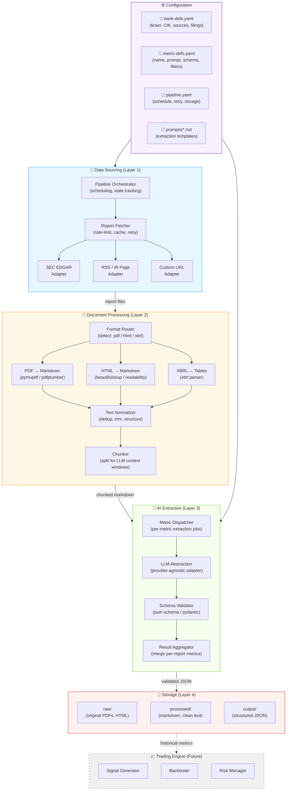
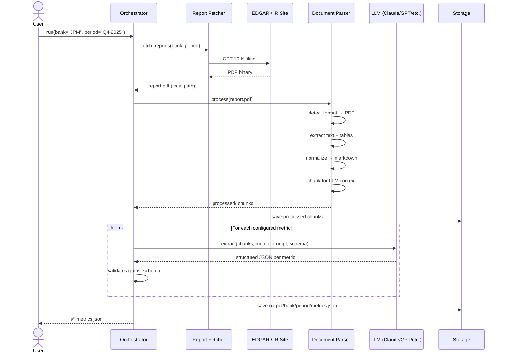
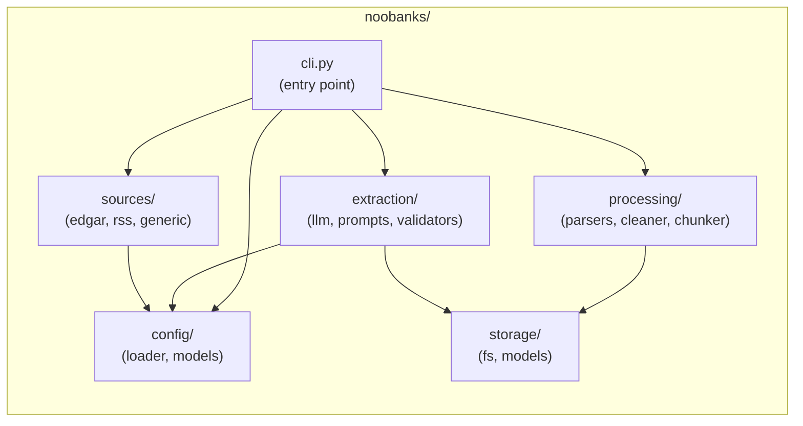
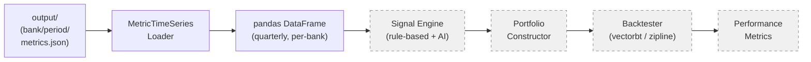

# NooBanks — Architecture

## System Overview



## Data Flow (per bank, per filing period)



## Package Structure



## Key Abstractions

| Module | Class / Interface | Responsibility |
|--------|------------------|----------------|
| `config` | `BankRegistry` | Loads & validates bank definitions from YAML |
| `config` | `MetricSpec` | Pydantic model for a metric: name, prompt template, output schema |
| `sources` | `SourceAdapter` | Abstract base: `async fetch(bank, period) → list[Report]` |
| `sources` | `EdgarAdapter` | SEC EDGAR — CIK lookup, filing search, XBRL/HTML download |
| `sources` | `RssAdapter` | Generic RSS/Atom feed scraper for bank IR pages |
| `processing` | `DocumentParser` | Format dispatch: PDF→md, HTML→md, XBRL→tables |
| `processing` | `TextChunker` | Splits long documents for LLM context windows |
| `extraction` | `LlmClient` | Provider-agnostic: `async complete(prompt) → str` |
| `extraction` | `MetricExtractor` | Runs one metric spec against document chunks, returns validated JSON |
| `extraction` | `ResultAggregator` | Merges per-metric results into a single output file |
| `storage` | `ReportStore` | Save/load raw reports, processed text, and output JSON |

## Directory Layout

```
noobanks/
├── pyproject.toml              # Build config, dependencies
├── README.md
├── docs/
│   └── architecture.md         # ← this file
├── config/
│   ├── banks.yaml              # Bank definitions
│   ├── metrics.yaml            # Metric extraction specs
│   └── pipeline.yaml           # Runtime config
├── prompts/
│   ├── net_interest_income.md  # Extraction prompt templates
│   ├── tier1_ratio.md
│   └── ...
├── src/noobanks/
│   ├── __init__.py
│   ├── cli.py                  # typer CLI entry point
│   ├── config/
│   │   ├── __init__.py
│   │   ├── loader.py           # YAML → pydantic models
│   │   └── models.py           # BankSpec, MetricSpec, PipelineConfig
│   ├── sources/
│   │   ├── __init__.py
│   │   ├── base.py             # SourceAdapter ABC
│   │   ├── edgar.py            # SEC EDGAR adapter
│   │   └── generic.py          # Generic URL / RSS adapter
│   ├── processing/
│   │   ├── __init__.py
│   │   ├── parser.py           # Format dispatch & parse
│   │   ├── cleaner.py          # Text normalization
│   │   └── chunker.py          # Context-window chunking
│   ├── extraction/
│   │   ├── __init__.py
│   │   ├── llm.py              # LLM abstraction layer
│   │   ├── extractor.py        # MetricExtractor (prompt + chunks → JSON)
│   │   └── prompts.py          # Prompt loader & renderer
│   └── storage/
│       ├── __init__.py
│       └── store.py            # ReportStore (raw / processed / output)
├── data/                       # .gitignore'd runtime data
│   ├── raw/                    # Downloaded PDFs / HTML
│   ├── processed/              # Parsed markdown per report
│   └── output/                 # Structured metrics JSON
└── tests/
    ├── __init__.py
    ├── test_sources/
    ├── test_processing/
    └── test_extraction/
```

## Consumer Flow (Trading Engine — Future)


